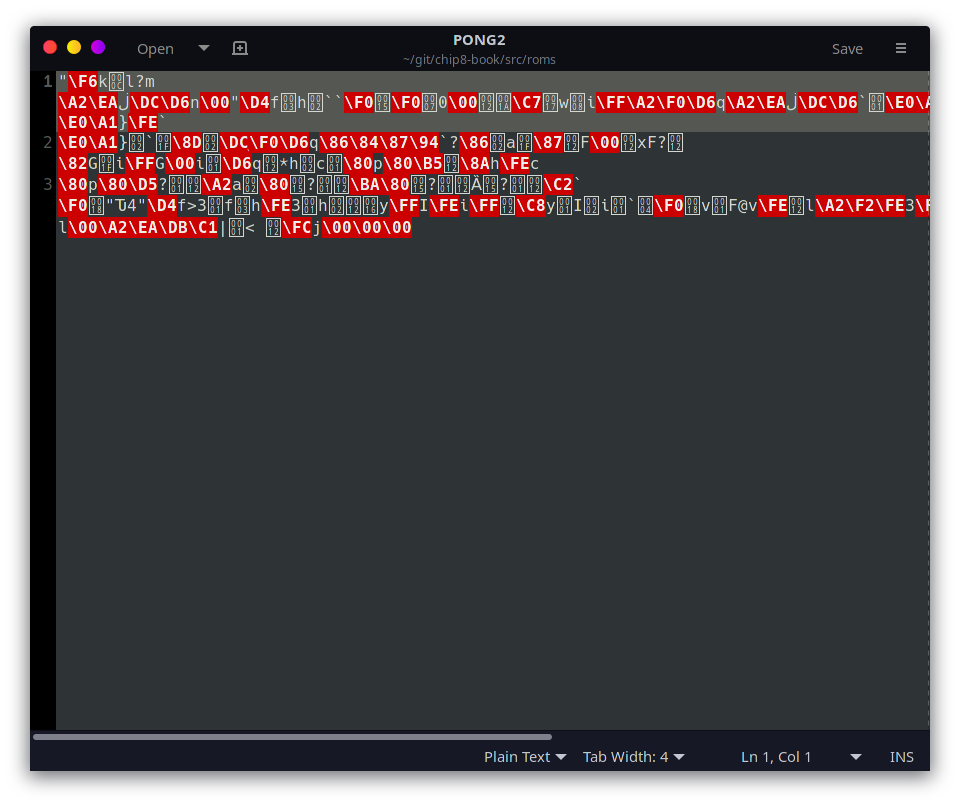
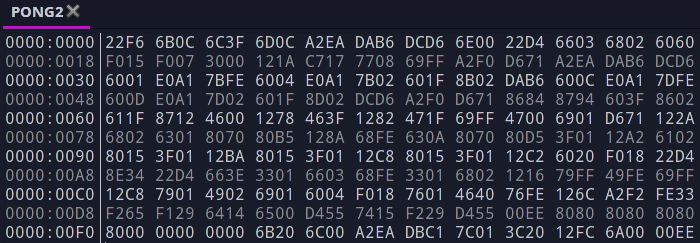

# Emulation Basics {#eb}

This first chapter will be an overview of the concepts of emulation development and the Chip-8. Subsequent chapters will have code implementations in Rust, but for those of you who have no interest in Rust or prefer to work without examples, this chapter will give an introduction to what steps a real system performs, what we need to emulate ourselves, and how all the moving pieces fit together. You may be familiar with some or all of these concepts already, so feel free to skim through. However, if you're completely new to this world, this should provide the information you'll need to wrap your head around what exactly you're about to implement.

## What's in a Chip-8 Game?

Let's begin with a simple question. If I give you a Chip-8 ROM[^1] file, what exactly is in it? Somehow it needs to contain all of the game logic and graphical assets needed to make a game run on a screen, but how is it all laid out?

This is a basic, fundamental question, and we're going to need to figure it out at some point as we're going to have to read in this file and make it run. Well, there's only one way to find out so let's try and open a Chip-8 game in a text editor (such as Notepad, TextEdit, or any others you prefer). For this example I'm using the `roms/PONG2` game included with this guide. Unless you're using a very fancy editor, you should probably see something similar to Figure 1.

This doesn't seem very helpful. In fact it seems corrupted, is this okay? Well, don't worry your game is (probably) just fine. All computer programs are, at their core, just numbers saved into a file. These numbers can mean just about anything, it's only with context that a computer is able to put meaning to the values. Your text editor was designed to show and edit text in a language such as English, and thus will automatically try and use a language-focused context such as [ASCII](https://www.asciitable.com/).

So we've learned that our Chip-8 file is not written in plain English, which we probably could have assumed already. So what does it look like? Fortunately, programs exist to display the raw contents of a file, and so we will need to use one of those "hex editors" to display the actual contents of our file.

In Figure 2, the numbers on the left of the vertical line are the *offset* values, how many bytes we are away from the start of the file. On the right hand side are the actual values stored in the file. Both the offsets and data values are displayed in hexadecimal (we'll be dealing with hexadecimal quite a bit).

Okay, we have numbers now, so that's an improvement. If those numbers don't correspond to English letters, what do they mean? These are the *instructions* for the Chip-8's CPU. Actually, each instruction is two bytes, which is why I've grouped them in pairs in the screenshot.

## What is a CPU?

Let me take a moment to describe exactly what functionality a CPU provides, for those who aren't familiar. A CPU, for our purposes, does math. That's it. Now, when I say it "does math", this includes your usual items such as addition, subtraction, and checking if two numbers are equal or not. There are also some additional operations that are needed for the game to run, such as jumping to different sections of code, or fetching and saving numbers. The game file is entirely made up of mathematical operations for the CPU to preform.

This is what the numbers represent in our ROM file. All of the mathematical operations that the Chip-8 can perform have a corresponding number, called its *opcode*. A full list of the Chip-8's opcodes can be seen on [this page](#ot). Whenever it is time for the emulator to perform another instruction (also referred to as a *tick* or a *cycle*), it will grab the next opcode from the game ROM and do whatever operation is specified by the opcode table; add, subtract, update what's drawn on the screen, whatever.

What about parameters? It's not enough to say "it's time to add", you need two numbers to actually add together, plus a place to put the sum when you're done. Other systems do this differently, but two bytes per operation is a lot of possible numbers, way more than the 35 operations that Chip-8 can actually do. The extra digits are used to pack in extra information into the opcode. The exact layout of this information varies between opcodes. The opcode table uses `N`'s to indicate literal hexadecmial numbers. `N` for single digit, `NN` for two digit, and `NNN` for three digit literal values, or for a *register* to be specified via `X` or `Y`.

## What are Registers?

Which brings us to our next topic. What on earth is a register? A register is a specially designated place to store a single byte for use in instructions. This may sound rather similar to RAM (which we'll cover in a second), and in some ways it is. If you're going to actually build a computer, there are significant hardware differences between the two, but for our purposes while RAM is a big array of numbers, there are usually way fewer registers, they are all named, and they are directly used as part of a CPU operation. For many computers, if you want to use a value in RAM, it has to be copied into a register first, and then used.

The Chip-8 has sixteen registers that can be used freely by the programmer, named V0 through VF (0-15 in hexadecimal). As an example of how registers can work, let's look at one of the addition operations in our opcode table. There is an operation for adding the values of two registers together, VX += VY, encoded as `8XY4`. The `8XY4` is used for pattern matching the opcodes. If the current opcode begins with an 8 and ends with a 4, then this is the matching operation. The middle two digits then specify which registers we are to use. Let's say our opcode is `8124`. It begins with an 8 and ends with a 4, so we're in the right place. For this instruction we will be using the values stored in V1 and V2, as those match the other two digits. Let's say V1 stores 5 and V2 stores 10, this operation would add those two values and replace what was in V1, thus V1 now holds 15.

Chip-8 contains a few more registers, but they serve very specific purposes. One of the most significant ones is the *program counter* (PC), which for Chip-8 can store 16-bit values. I've made vague references to our "current opcode", but how do we keep track of where we are? Our emulator is simulating a computer running a program. It needs to start at the beginning of our game and move from opcode to opcode, doing the instructions as it's told. The PC holds the index of what game instruction we're currently working on. So it'll start at the first byte of the game, then move on to the third (remember all opcodes are two bytes, so opcode two is actually the third bytes), and so on and so forth. Some instructions can also tell the PC to go somewhere else in the game, but by default it will simply move forward opcode by opcode, and that is how the game executes.

## What is RAM?

We have our sixteen V registers, but even for a simple system like a Chip-8, we really would like to be able to store more than 16 numbers at a time. This is now where RAM comes in. You're probably familiar with it in the context of your own computer, but RAM is a large array of numbers for the CPU to do with as it pleases. Chip-8 is not a physical system, so there is no standard amount of RAM it is supposed to have. However, emulation developers have more or less settled on 4096 bytes (4 KB), so our system will have the ability to store up to 4096 8-bit numbers in its RAM, frankly way more than most games will use.

Now, time for an important detail. The Chip-8 CPU has free access to read and write to RAM as it pleases. It does not, however, have access to our game ROM. Now with a name like "Read-Only Memory", it's safe to assume that we weren't going to be able to overwrite it, but the CPU can't read from ROM either? This whole guide so far has been about how the CPU deals with our ROM data! The CPU of course needs to be able to read the game ROM, and the way it does this is when game first begins running, the entire game is copied into RAM[^2]. Think of it this way. It is rather slow and wasteful to open our game file just to read a little bit of data over and over again. Instead, we want to be able to copy as much data as we can into RAM for us to be able to more quickly use. The other catch to this is that somewhat confusingly, the ROM data is not loaded into very start of RAM. Instead, it's offset by 512 bytes (0x200). I.E. the first byte of ROM is loaded at start into RAM address 0x200. The second ROM byte into 0x201, etc.

Why do this? Why doesn't the Chip-8 simply store the game at the start of RAM and call it a day? The short answer is back when the Chip-8 was designed, there was a much more limited amount of RAM, and only one program could run at a given time. That means that the Chip-8 program itself would have to go somewhere, and the first 0x200 were allocated for that reason. Thus, modern Chip-8 emulators need to keep that in mind, as games are still written with that concept. Our system will actually use a little bit of that empty space, but we will cover that later.

That's pretty much it for the conceptual portion of this document. The Chip-8 has various other systems, but they're pretty straight-forward such as the display and keys. The remainder of this guide builds the emulator piece by piece in Rust, with a more depth focus on the various components as they come up.

[^1]: 'ROM' stands for "Read-only memory". It is a type of memory that is hard written at manufacturing time and cannot be modified by the computer system. For the purposes of this guide "ROM file" will be used interchangeably with "game file".

[^2]: Therefore, Chip-8 games have a maximum size of 4 KB, any larger and they can't be loaded completed in.

\newpage
