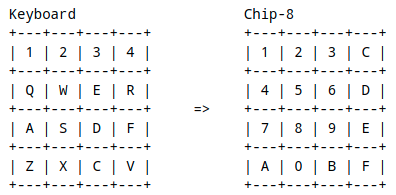

# Writing our Desktop Frontend {#dfe}

In this section, we will finally connect all the pieces and get our emulator to load and run a game. At this stage, our emulator core is capable of parsing and processing the game's opcodes, and being able to update the screen, RAM, and the registers as needed. Next, we will need to add some public functions to expose some functionality to the frontend, such as loading in a game, accepting user input, and sharing the screen buffer to be displayed.

## Exposing the Core to the Frontend

We are not done with our `chip8_core` just yet. We need to add a few public functions to our `Emu` struct to give access to some of its items.

In `chip8_core/src/lib.rs`, add the following method to our `Emu` struct:

```rust
impl Emu {
    // -- Unchanged code omitted --

    pub fn get_display(&self) -> &[bool] {
        &self.screen
    }

    // -- Unchanged code omitted --
}
```

This simply passes a pointer to our screen buffer array up to the frontend, where it can be used to render to the display.

Next, we will need to handle key presses. We already have a `keys` array, but it never actually gets written to. Our frontend will handle actually reading keyboard presses, but we'll need to expose a function that allows it to interface and set elements in our `keys` array.

```rust
impl Emu {
    // -- Unchanged code omitted --

    pub fn keypress(&mut self, idx: usize, pressed: bool) {
        self.keys[idx] = pressed;
    }

    // -- Unchanged code omitted --
}
```

This function is rather straightforward. It takes the index of the key that has been pressed and sets the value. We could have split this function into a `press_key` and `release_key` function, but this is simple enough that I think the intention still comes across. Keep in mind that `idx` needs to be under 16 or else the program will panic. You can add that restriction here, but instead we'll handle it in the frontend and assume that it's been done correctly in the backend, rather than checking it twice.

Lastly, we need some way to load the game code from a file into our RAM so it can be executed. We'll dive into this more deeply when we begin reading from a file in our frontend, but for now we need to take in a list of bytes and copy them into our RAM.

```rust
impl Emu {
    // -- Unchanged code omitted --

    pub fn load(&mut self, data: &[u8]) {
        let start = START_ADDR as usize;
        let end = (START_ADDR as usize) + data.len();
        self.ram[start..end].copy_from_slice(data);
    }

    // -- Unchanged code omitted --
}
```

This function copies all the values from our input `data` slice into RAM beginning at 0x200. Remember that the first 512 bytes of RAM aren't to contain game data, and are empty except for the character sprite data we store there.

## Frontend Setup

Finally, let's setup the frontend of the emulator so we can test things out and (hopefully) play some games! Making a fancy GUI interface is beyond the scope of this guide, we will simply start the emulator and choose which game to play via a command line argument. Let's set that up now.

In `desktop/src/main.rs` we will need to read the command line arguments to receive the path to our game ROM file. We could create several flags for additional configuration, but we'll keep it simple and say that we'll require exactly one argument - the path to the game. Any other number and we'll exit out with an error.

```rust
use std::env;

fn main() {
    let args: Vec<_> = env::args().collect();
    if args.len() != 2 {
        println!("Usage: cargo run path/to/game");
        return;
    }
}
```

This grabs all of the passed command line parameters into a vector, and if there isn't two (the name of the program is always stored in `args[0]`), then we print out the correct input and exit. The path passed in by the user is now stored in `args[1]`. We'll have to make sure that's a valid file once we attempt to open it, but first, we have some other stuff to setup.

## Creating a Window

For this emulation project, we are going to use the SDL library to create our game window and render to it. SDL is an excellent drawing library to use with good support for key presses and drawing. There's a small amount of boilerplate we'll need in order to set it up, but once that's done we can begin our emulation.

First, we'll need to include it into our project. Open `desktop/Cargo.toml` and add `sdl2` to our dependencies:

```toml
[dependencies]
chip8_core = { path = "../chip8_core" }
sdl2 = "^0.34.3
```

Now back in `desktop/src/main.rs`, we can begin bringing it all together. We'll need the public functions we defined in our core, so let's tell Rust we'll need those with `use chip8_core::*`.

```rust
use chip8_core::*;
use std::env;

fn main() {
    let args: Vec<_> = env::args().collect();
    if args.len() != 2 {
        println!("Usage: cargo run path/to/game");
        return;
    }
}
```

Inside `chip8_core`, we created public constants to hold the screen size, which we are now importing. However, a 64x32 game window is really small on today's monitors, so let's go ahead and scale it up a bit. After experimenting with some numbers, a 15x scale works well on my monitor, but you can tweak this if you prefer something else.

```rust
const SCALE: u32 = 15;
const WINDOW_WIDTH: u32 = (SCREEN_WIDTH as u32) * SCALE;
const WINDOW_HEIGHT: u32 = (SCREEN_HEIGHT as u32) * SCALE;
```

Recall that `SCREEN_WIDTH` and `SCREEN_HEIGHT` were public constants we defined in our backend and are now included into this crate via the `use chip8_core::*` statement. SDL will require screen sizes to be `u32` rather than `usize` so we'll cast them here.

It's time to create our SDL window! The following code simply creates a new SDL context, then makes the window itself and the canvas that we'll draw upon.

```rust
fn main() {
    // -- Unchanged code omitted --

    // Setup SDL
    let sdl_context = sdl2::init().unwrap();
    let video_subsystem = sdl_context.video().unwrap();
    let window = video_subsystem
        .window("Chip-8 Emulator", WINDOW_WIDTH, WINDOW_HEIGHT)
        .position_centered()
        .opengl()
        .build()
        .unwrap();

    let mut canvas = window.into_canvas().present_vsync().build().unwrap();
    canvas.clear();
    canvas.present();
}
```

We'll initialize SDL and tell it to create a new window of our scaled up size. We'll also have it be created in the middle of the user's screen. We'll then get the canvas object we'll actually draw to, with VSYNC on. Then go ahead and clear it and show it to the user.

If you attempt to run it now (give it a dummy file name to test, like `cargo run test`), you'll see a window pop up for a brief moment before closing. This is because the SDL window is created briefly, but then the program ends and the window closes. We'll need to create our main game loop so that our program doesn't end immediately, and while we're at it, let's add some handling to quit the program if we try to exit out of the window (otherwise you'll have to force quit the program from your task manager).

SDL uses something called an *event pump* to poll for events every loop. By checking this, we can cause different things to happen for given events, such as attempting to close the window or pressing a key. For now, we'll just have the program break out of the main game loop if it needs the window to close.

We'll need to tell Rust that we wish to use SDL's `Event`:

```rust
use sdl2::event::Event;
```

And modify our `main` function to add our basic game loop:

```rust
fn main() {
    // -- Unchanged code omitted --

    // Setup SDL
    let sdl_context = sdl2::init().unwrap();
    let video_subsystem = sdl_context.video().unwrap();
    let window = video_subsystem
        .window("Chip-8 Emulator", WINDOW_WIDTH, WINDOW_HEIGHT)
        .position_centered()
        .opengl()
        .build()
        .unwrap();

    let mut canvas = window.into_canvas().present_vsync().build().unwrap();
    canvas.clear();
    canvas.present();

    let mut event_pump = sdl_context.event_pump().unwrap();

    'gameloop: loop {
        for evt in event_pump.poll_iter() {
            match evt {
                Event::Quit{..} => {
                    break 'gameloop;
                },
                _ => ()
            }
        }
    }
}
```

This addition sets up our main game loop, which checks if any events have been triggered. If the `Quit` event is detected (by attempting to close the window), then the program breaks out of the loop, causing it to end. If you try to run it again via `cargo run test`, you'll see a new black window pop-up, with the title of 'Chip-8 Emulator'. The window should successfully close without issue.

It lives! Next up, we'll initialize our emulator's `chip8_core` backend, and open and load the game file.

## Loading a File

Our frontend can now create a new emulation window, so it's time to start getting the backend up and running as well. Our next step will be to actually read in a game file, and pass its data to the backend to be stored in RAM and executed upon. Firstly, we need to actually have a backend object to pass things to. Still in `frontend/src/main.rs`, let's create our emulation object. Our `Emu` object has already been included with all the other public items from `chip8_core`, so we're free to initialize.

```rust
fn main() {
    // -- Unchanged code omitted --

    let mut chip8 = Emu::new();

    'gameloop: loop {
        // -- Unchanged code omitted --
    }
}
```

Creating the `Emu` object needs to go somewhere prior to our main game loop, as that is where the emulation drawing and key press handing will go. Remember that the path to the game is being passed in by the user, so we'll also need to make sure this file actually exists before we attempt read it in. We'll need to first `use` a few items from the standard library in `main.rs` to open a file.

```rust
use std::fs::File;
use std::io::Read;
```

Pretty self-explanatory there. Next, we'll open the file given to us as a command line parameter, read it into a buffer, then pass that data into our emulator backend.

```rust
fn main() {
    // -- Unchanged code omitted --
    let mut chip8 = Emu::new();

    let mut rom = File::open(&args[1]).expect("Unable to open file");
    let mut buffer = Vec::new();

    rom.read_to_end(&mut buffer).unwrap();
    chip8.load(&buffer);
    // -- Unchanged code omitted --
}
```

A few things to note here. In the event that Rust is unable to open the file from the path the user gave us (likely because it doesn't exist), then the `expect` condition will fail and the program will exit with that message. Secondly, we could give the file path to the backend and load the data there, but reading a file is a more frontend-type behavior and it better fits here. More importantly, our eventual plan is to make this emulator work in a web browser with little to no changes to our backend. How a browser reads a file is very different to how your file system will do it, so we will allow the frontends to handle the reading, and pass in the data once we have it.

## Running the Emulator and Drawing to the Screen

The game has been loaded into RAM and our main loop is running. Now we need to tell our backend to begin processing its instructions, and to actually draw to the screen. If you recall, the emulator runs through a clock cycle each time its `tick` function is called, so let's add that to our loop.

```rust
fn main() {
    // -- Unchanged code omitted --

    'gameloop: loop {
        for event in event_pump.poll_iter() {
            // -- Unchanged code omitted --
        }

        chip8.tick();
    }
}
```

Now every time the loop cycles, the emulator will progress through another instruction. This may seem too easy, but we've set it up so `tick` moves all the pieces of the backend, including modifying our screen buffer. Let's add a function that will grab the screen data from the backend and update our SDL window. First, we need to `use` a few additional elements from SDL:

```rust
use sdl2::pixels::Color;
use sdl2::rect::Rect;
use sdl2::render::Canvas;
use sdl2::video::Window;
```

Next, the function, which will take in a reference to our `Emu` object, as well as a mutable reference to our SDL canvas. Drawing the screen requires a few steps. First, we clear the canvas to erase the previous frame. Then, we iterate through the screen buffer, drawing a white rectangle anytime the given value is true. Since Chip-8 only supports black and white; if we clear the screen as black, we only have to worry about drawing the white squares.

```rust
fn draw_screen(emu: &Emu, canvas: &mut Canvas<Window>) {
    // Clear canvas as black
    canvas.set_draw_color(Color::RGB(0, 0, 0));
    canvas.clear();

    let screen_buf = emu.get_display();
    // Now set draw color to white, iterate through each point and see if it should be drawn
    canvas.set_draw_color(Color::RGB(255, 255, 255));
    for (i, pixel) in screen_buf.iter().enumerate() {
        if *pixel {
            // Convert our 1D array's index into a 2D (x,y) position
            let x = (i % SCREEN_WIDTH) as u32;
            let y = (i / SCREEN_WIDTH) as u32;

            // Draw a rectangle at (x,y), scaled up by our SCALE value
            let rect = Rect::new((x * SCALE) as i32, (y * SCALE) as i32, SCALE, SCALE);
            canvas.fill_rect(rect).unwrap();
        }
    }
    canvas.present();
}
```

To summarize this function, we get our 1D screen buffer array and iterate across it. If we find a white pixel (a true value), then we calculate the 2D (x, y) of the screen and draw a rectangle there, scaled up by our `SCALE` factor.

We'll call this function in our main loop, just after we `tick`.

```rust
fn main() {
    // -- Unchanged code omitted --

    'gameloop: loop {
        for event in event_pump.poll_iter() {
            // -- Unchanged code omitted --
        }

        chip8.tick();
        draw_screen(&chip8, &mut canvas);
    }
}
```

Some of you might be raising your eyebrows at this. The screen should be updated at 60 frames per second, or 60 Hz. Surely the emulation needs to happen faster than that? It does, but hold that thought for now. We'll start by making sure it works at all before we fix the timings.

If you have a Chip-8 game downloaded, go ahead and try running your emulator with an actual game via:

```
$ cargo run path/to/game
```

If everything has gone well, you should see the window appear and the game begin to render and play! You should feel accomplished for getting this far with your very own emulator.

As I mentioned previously, the emulation `tick` speed should probably run faster than the canvas refresh rate. If you watch your game run, it might feel a bit sluggish. Right now, we execute one instruction, then draw to the screen, then repeat. As you're aware, it takes several instructions to be able to do any meaningful changes to the screen. To get around this, we will allow the emulator to tick several times before redrawing.

Now, this is where things get a bit experimental. The Chip-8 specification says nothing about how quickly the system should actually run. Even leaving it is now so it runs at 60 Hz is a valid solution (and you're welcome to do so). We'll simply allow our `tick` function to loop several times before moving on to drawing the screen. Personally, I (and other emulators I've looked at) find that 10 ticks per frame is a nice sweet spot.

```rust
const TICKS_PER_FRAME: usize = 10;
// -- Unchanged code omitted --

fn main() {
    // -- Unchanged code omitted --

    'gameloop: loop {
        for event in event_pump.poll_iter() {
            // -- Unchanged code omitted --
        }

        for _ in 0..TICKS_PER_FRAME {
            chip8.tick();
        }
        draw_screen(&chip8, &mut canvas);
    }
}
```

Some of you might feel this is a bit hackish (I somewhat agree with you). However, this is also how more 'sophisticated' systems work, with the exception that those CPUs usually have some way of notifying the screen that it's ready to redraw. Since the Chip-8 has no such mechanism nor any defined clock speed, this is a easier way to accomplish this task.

If you run again, you might notice that it doesn't get very far before pausing. This is likely due to the fact that we never update our two timers, so the emulator has no concept of how long time has passed for its games. I mentioned earlier that the timers run once per frame, rather than at the clock speed, so we can modify the timers at the same point as when we modify the screen.

```rust
fn main() {
    // -- Unchanged code omitted --

    'gameloop: loop {
        for event in event_pump.poll_iter() {
            // -- Unchanged code omitted --
        }

        for _ in 0..TICKS_PER_FRAME {
            chip8.tick();
        }
        chip8.tick_timers();
        draw_screen(&chip8, &mut canvas);
    }
}
```

There's still a few things left to implement (you can't actually control your game for one) but it's a great start, and we're on the final stretches now!

## Adding User Input

We can finally render our Chip-8 game to the screen, but we can't get very far into playing it as we have no way to control it. Fortunately, SDL supports reading in inputs to the keyboard which we can translate and send to our backend emulation.

As a refresher, the Chip-8 system supports 16 different keys. These are typically organized in a 4x4 grid, with keys 0-9 organized like a telephone with keys A-F surrounding. While you are welcome to organize the keys in any configuration you like, some game devs assumed they're in the grid pattern when choosing their games inputs, which means it can be awkward to play some games otherwise. For our emulator, we'll use the left-hand keys of the QWERTY keyboard as our inputs, as shown below.

Let's create a function to convert SDL's key type into the values that we will send to the emulator. We'll need to bring SDL keyboard support into `main.rs` via:

```rust
use sdl2::keyboard::Keycode;
```

Now, we'll create a new function that will take in a `Keycode` and output an optional `u8` value. There are only 16 valid keys, so we'll wrap a valid output valid in `Some`, and return `None` if the user presses a non-Chip-8 key. This function is then just pattern matching all of the valid keys as outlined in the image above.

```rust
fn key2btn(key: Keycode) -> Option<usize> {
    match key {
        Keycode::Num1 =>    Some(0x1),
        Keycode::Num2 =>    Some(0x2),
        Keycode::Num3 =>    Some(0x3),
        Keycode::Num4 =>    Some(0xC),
        Keycode::Q =>       Some(0x4),
        Keycode::W =>       Some(0x5),
        Keycode::E =>       Some(0x6),
        Keycode::R =>       Some(0xD),
        Keycode::A =>       Some(0x7),
        Keycode::S =>       Some(0x8),
        Keycode::D =>       Some(0x9),
        Keycode::F =>       Some(0xE),
        Keycode::Z =>       Some(0xA),
        Keycode::X =>       Some(0x0),
        Keycode::C =>       Some(0xB),
        Keycode::V =>       Some(0xF),
        _ =>                None,
    }
}
```



Next, we'll add two additional events to our main event loop, one for `KeyDown` and the other for `KeyUp`. Each event will check if the pressed key gives a `Some` value from our `key2btn` function, and if so pass it to the emulator via the public `keypress` function we defined earlier. The only difference between the two will be if it sets or clears.

```rust
fn main() {
    // -- Unchanged code omitted --
    'gameloop: loop {
        for evt in event_pump.poll_iter() {
            match evt {
                Event::Quit{..} => {
                    break 'gameloop;
                },
                Event::KeyDown{keycode: Some(key), ..} => {
                    if let Some(k) = key2btn(key) {
                        chip8.keypress(k, true);
                    }
                },
                Event::KeyUp{keycode: Some(key), ..} => {
                    if let Some(k) = key2btn(key) {
                        chip8.keypress(k, false);
                    }
                },
                _ => ()
            }

        for _ in 0..TICKS_PER_FRAME {
            chip8.tick();
        }
        chip8.tick_timers();
        draw_screen(&chip8, &mut canvas);
    }
    // -- Unchanged code omitted --
}
```

The `if let` statement is only satisfied if the value on the right matches that on the left, namely that `key2btn(key)` returns a `Some` value. The unwrapped value is then stored in `k`.

Let's also add a common emulator ability - quitting the program by pressing Escape. We'll add that alongside our `Quit` event.

```rust
fn main() {
    // -- Unchanged code omitted --
    'gameloop: loop {
        for evt in event_pump.poll_iter() {
            match evt {
                Event::Quit{..} | Event::KeyDown{keycode: Some(Keycode::Escape), ..}=> {
                    break 'gameloop;
                },
                Event::KeyDown{keycode: Some(key), ..} => {
                    if let Some(k) = key2btn(key) {
                        chip8.keypress(k, true);
                    }
                },
                Event::KeyUp{keycode: Some(key), ..} => {
                    if let Some(k) = key2btn(key) {
                        chip8.keypress(k, false);
                    }
                },
                _ => ()
            }
        }

        for _ in 0..TICKS_PER_FRAME {
            chip8.tick();
        }
        chip8.tick_timers();
        draw_screen(&chip8, &mut canvas);
    }
    // -- Unchanged code omitted --
}
```

Unlike the other key events, where we would check the found `key` variable, we want to use the Escape key to quit. If you don't want this ability in your emulator, or would like some other key press functionality, you're welcome to do so.

That's it! The desktop frontend of our Chip-8 emulator is now complete. We can specify a game via a command line parameter, load and execute it, display the output to the screen, and handle user input.

I hope you were able to get an understanding of how emulation works. Chip-8 is a rather basic system, but the techniques discussed here form the basis for how all emulation works.

However, this guide isn't done! In the next section I will discuss how to build our emulator with WebAssembly and getting it to run in a web browser.

\newpage
